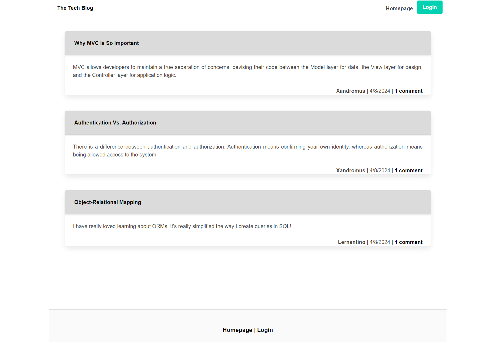
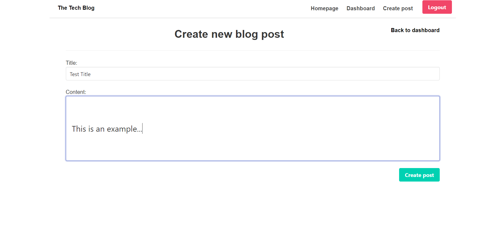
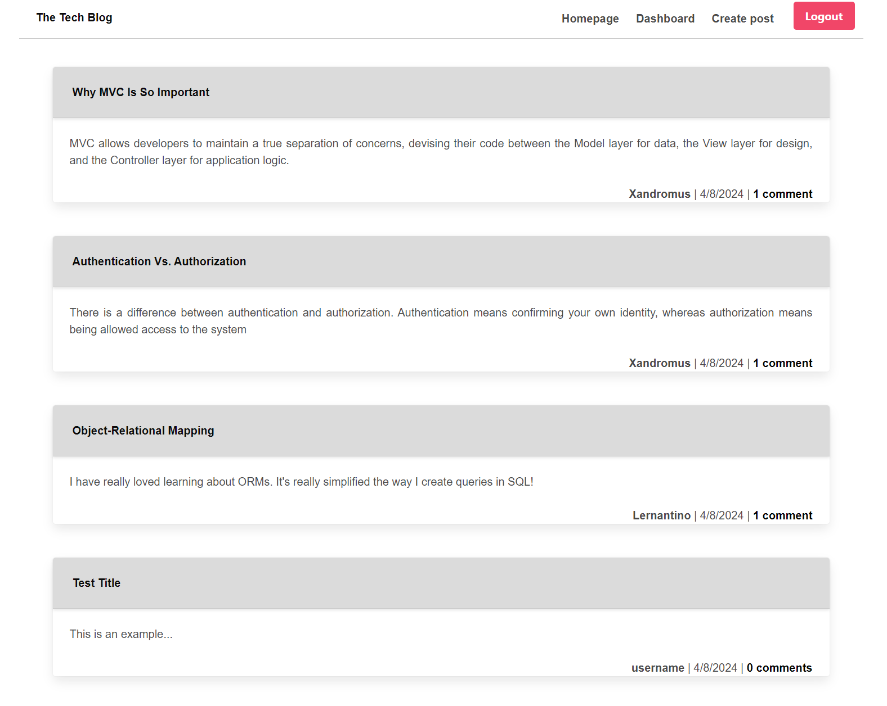

# Blog-Post

## Description
Blog Post is a website designed to allow the user to create, read, edit, and delete posts that they create. You will use the sign-up button to create an account and login under your own profile to share to the website your own ideas.

## Link to Deployed Site
[Deployed Site]()